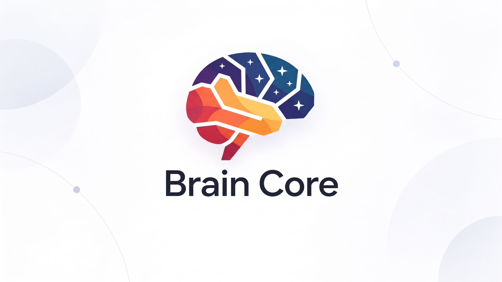
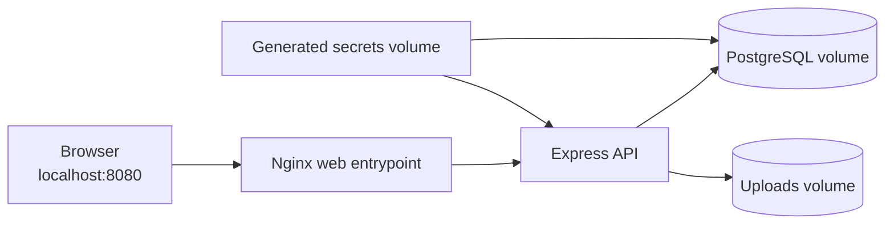

# Brain Core

> A self-hosted workspace for notes, visual thinking, and personal knowledge.

Brain Core runs in Docker on a machine you control. It stores pages, attachments,
and database data in volumes attached to that installation. A standard setup
needs no cloud account or external sync.



### Screenshots


**Built with:** React 19 · TypeScript · Vite · Tailwind CSS · Tiptap · tldraw ·
Node.js · Express · Socket.IO · PostgreSQL · Docker

## Why Brain Core?

Brain Core gives you a personal workspace you can run and manage yourself.

- **Self-hosted storage.** Your database and uploads stay in Docker volumes on the machine running your installation.
- **One-command onboarding.** Run Docker Compose, open the browser, and create the first administrator account.
- **A flexible workspace.** Combine rich notes, nested pages, tags, dates, versions, trash, and visual canvases.
- **Security-conscious defaults.** The database is not exposed to the host; the web entrypoint binds to loopback; terminal and external integrations start disabled.

## What it includes

- Rich-text editor, page tree, subpages, tags, status, due dates, version history, and trash.
- Infinite visual canvas powered by tldraw.
- Authenticated attachments with file-type/content validation and local storage limits.
- Live updates between browser tabs through Socket.IO.
- Cookie-based authentication, login throttling, optional 2FA, and trusted-device support.
- Optional AI organization, Telegram reminders, and memory-device integration—off by default.

## Experimental timeline and companion recorder

**Timeline** is an experimental, opt-in memory workspace. It organizes sessions
chronologically, lets you search transcripts, and can help distinguish speakers
from a short voice sample. It is designed for a personal, self-hosted setup.

The browser does **not** continuously record audio. Capturing sessions requires
a separately configured Android companion recorder and a local processing
service, which can use local GPU processing for transcription. Those components
are not bundled with this repository or the standard Docker setup.
Docker starts with the integration offline, so an empty timeline in a fresh
installation is expected.

See [the timeline integration guide](docs/REMEMBER_TIMELINE.md) before enabling
it. The companion APK and its recording workflow are still under development
and testing; treat this as an experimental integration and obtain consent from
anyone whose voice may be recorded.

## Quick start

**Requirement:** Docker Engine with Docker Compose.

```bash
git clone https://github.com/lizard-wizard42/Brain_Core.git
cd Brain_Core
docker compose up --build -d
```

Open [http://localhost:8080](http://localhost:8080). On a fresh installation,
the browser opens the **first-access wizard**. Create the administrator account
there and you are ready to work.

No `.env` file is needed for a standard installation. Compose generates the
PostgreSQL password and JWT secret once and keeps them in a private local
volume. The setup endpoint closes permanently after the first account exists.

To start with clearly fictional sample content, copy `.env.docker.example` to
`.env.docker`, set `SEED_DEMO_DATA=true`, then run:

```bash
docker compose --env-file .env.docker up --build -d
```

## How data stays local



- Only the web entrypoint is published, at `127.0.0.1:8080` by default.
- PostgreSQL has no host port.
- Uploads and database contents use separate persistent local volumes.
- The terminal is a privileged feature and is disabled in the Docker profile.

For LAN or internet exposure, do not simply change the port binding. Configure
a TLS reverse proxy, secure cookies, explicit CORS origins, and trusted proxies
first. See [the Docker guide](docs/DOCKER.md).

## Architecture and security

The browser talks to a local Nginx proxy, which forwards API, upload, and
Socket.IO traffic to the Express backend. The backend owns authentication,
upload validation, application rules, and PostgreSQL persistence.

- [Architecture overview](docs/ARQUITETURA.md)
- [Docker installation and operations](docs/DOCKER.md)
- [Security policy](SECURITY.md)
- [Public-release plan and audit trail](docs/PLANO_REPOSITORIO_PUBLICO.md)

## Development

```bash
cd backend && npm install
cd ../frontend && npm install
cd ..
./dev-up.sh
```

Run the checks with:

```bash
cd backend && npm test
cd ../frontend && npm test && npm run build
```

## Contributing

Contributions are welcome. Please read [CONTRIBUTING.md](CONTRIBUTING.md)
before opening an issue or pull request. For vulnerabilities, follow the
private reporting instructions in [SECURITY.md](SECURITY.md) instead of opening
a public issue.

## Support the project

If Brain Core is useful to you and you would like to support its continued
development, you can [buy the creator a coffee](https://buymeacoffee.com/lizardwizard).

## License

Brain Core is available under the [MIT License](LICENSE). You may use, modify,
and redistribute the code, including commercially, while preserving the license
notice. The project name and visual identity do not imply endorsement or
affiliation.
