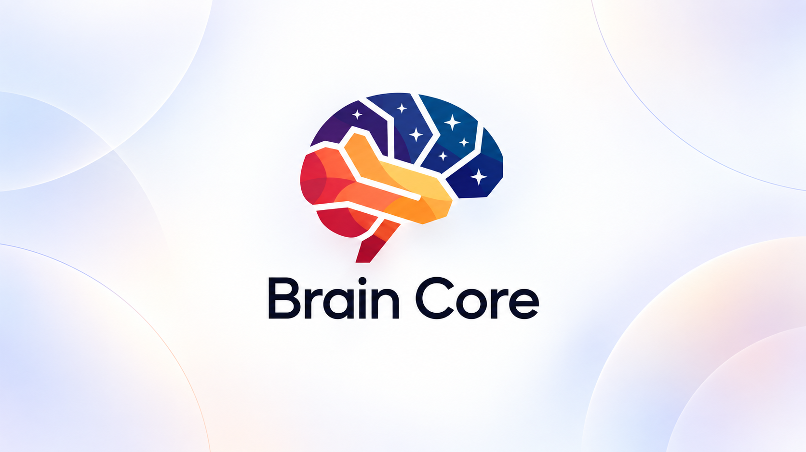
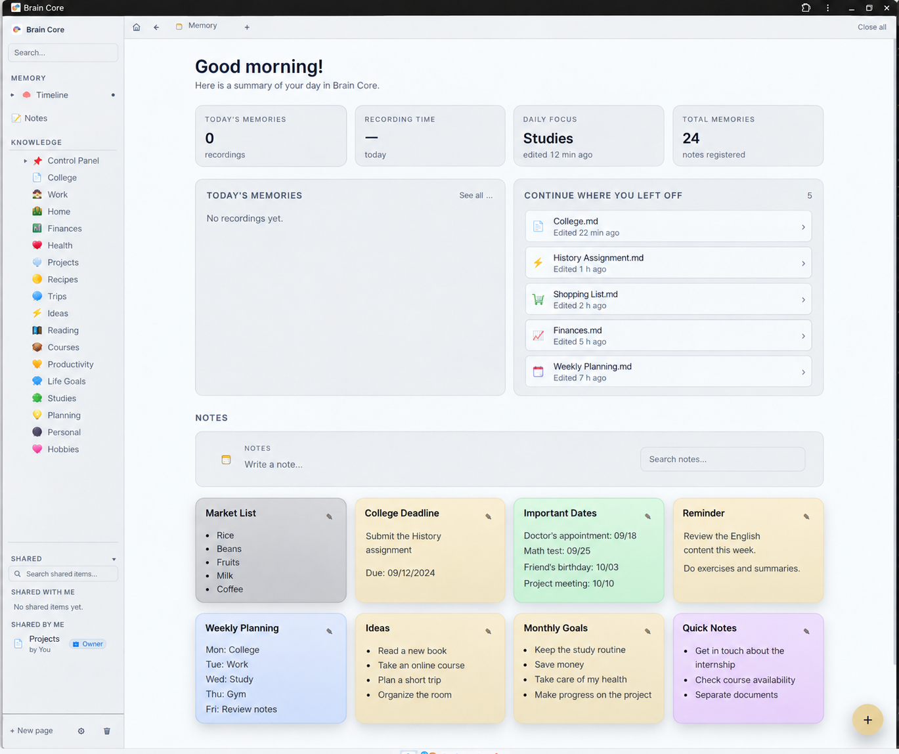
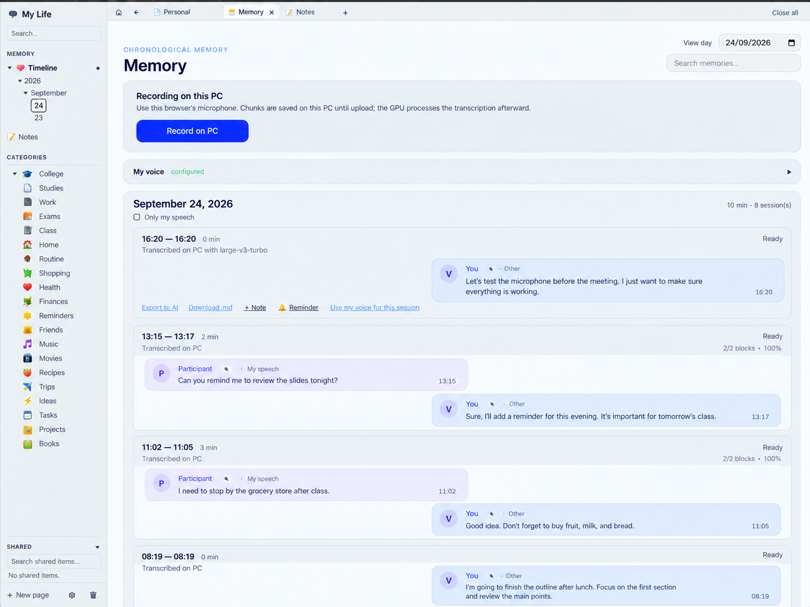
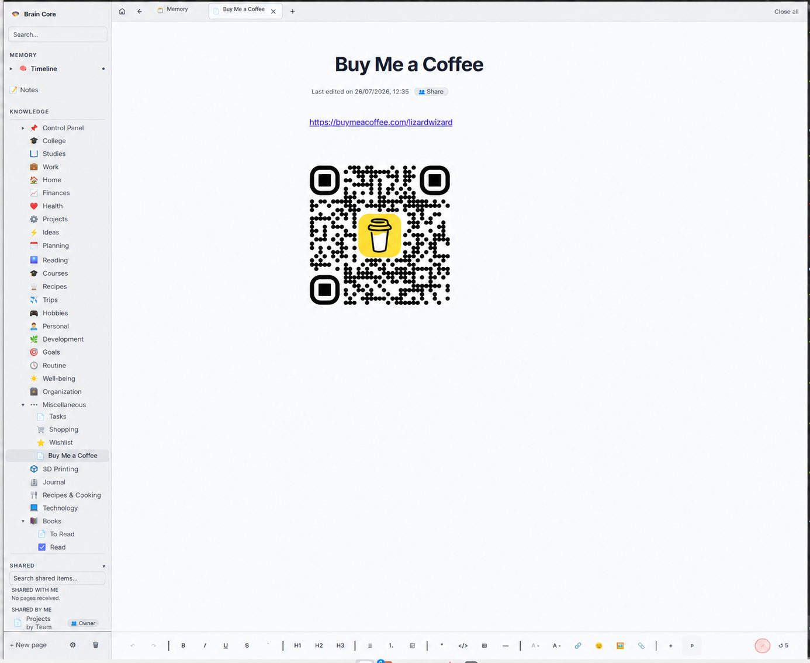
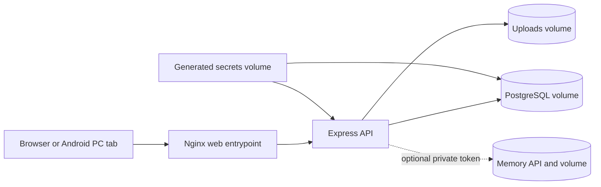

# Brain Core

> A self-hosted workspace for notes, visual thinking, recordings, and personal knowledge.

Brain Core runs on a computer you control. Its database, uploads, and optional
recordings live in persistent local volumes. The standard Docker installation
needs no cloud account, API key, GPU, or external sync service.



### Screenshots

These screenshots use fictional content.







**Built with:** React 19 · TypeScript · Vite · Tailwind CSS · Tiptap · tldraw ·
Node.js · Express · Socket.IO · PostgreSQL · Docker

## Features

### Pages, notes, and canvas

| Area | What you can do |
| --- | --- |
| Rich pages | Write and format content in Tiptap; organize pages and subpages in a tree; add tags, status, and due dates. |
| Quick notes | Capture short notes and reminders on a compact board and search them. Telegram reminders are optional and require your own bot configuration. |
| Visual pages | Sketch and arrange ideas on an infinite tldraw canvas. |
| History and recovery | Review page versions and restore pages from trash. Trash is cleaned up after 30 days by default. |
| Attachments | Upload supported images and documents with server-side type and content checks. Read an attached PDF inside the page; download other supported documents. |
| Sharing | Add another registered user as a contact, then share a page or folder with viewer or editor permission. There are no public share links. |
| Live work | See page updates across browser tabs through Socket.IO. Use app tabs, themes, and a mobile-friendly layout. |

Authentication uses session cookies, login throttling, optional TOTP
two-factor authentication, and trusted-device support. The first account is
created through a one-time setup wizard. Optional AI organization and the
host terminal require separate configuration; the standard Docker profile
starts with the terminal disabled.

### Recording, Timeline, and transcription

Recording starts only after a user action. In the browser, grant microphone
access and start a recording from the Timeline. On Android, tap **Gravar** in
**Linha do tempo**; the app stores roughly two-minute `.m4a` chunks in its
private storage. Its upload queue survives network loss and app restarts, and
marks a chunk uploaded only after the server confirms its SHA-256. Recordings
remain tied to the linked account.

The optional Memory service can transcribe recordings locally, group sessions
by date, search transcripts, show speaker turns, and let you review or correct
participant suggestions. You can turn transcript content into a Brain Core
note or reminder. A voice sample is only a suggestion for speaker matching;
review the result before assigning a person. The standard installation keeps
Memory **offline**. Phone recording and local playback work without it, but
server upload and transcription require the private Memory API and worker.

Use the [Timeline and CPU setup guide](docs/REMEMBER_TIMELINE.md) to enable the
service. The default worker runs on CPU in Docker. For acceleration on a Linux
computer with a compatible NVIDIA GPU, use the [GPU worker guide](services/gpu-worker/README.md).
AMD and Intel users can use the CPU worker; ROCm and oneAPI GPU execution have
not been validated in this project. No model, recording, voiceprint, token, or
transcript is included in the repository or APK.

### Android app and private HTTPS access

Download the signed [Android APK](https://github.com/lizard-wizard42/Brain_Core/releases/latest/download/brain-core-android.apk)
and compare its SHA-256 with the [latest release notes](https://github.com/lizard-wizard42/Brain_Core/releases/latest).
The app requires Android 7.0 or newer and uses the package
`com.example.braincore`. It has a local recorder and Timeline, plus a **PC** tab
that opens your own Brain Core web interface. The APK contains no server
address, account, recording, or service token. Local Android notes are not
synchronized with web notes in this version.

For phone access without publishing Brain Core to the internet, follow the
[Tailscale Serve guide](docs/ANDROID.md). Install Tailscale on the computer and
phone, give the local web entrypoint a private HTTPS address, enter that origin
in **Ajustes**, sign in through **PC**, and select **Vincular gravações**.
The device credential is protected by Android Keystore. Use Tailscale **Serve**,
not Funnel; only the web entrypoint should be reachable from the phone.

## Quick start

**Requirement:** Docker Engine with Docker Compose. On a new machine:

```bash
git clone https://github.com/lizard-wizard42/Brain_Core.git
cd Brain_Core
docker compose up --build -d
docker compose ps
```

Open [http://localhost:8080](http://localhost:8080). The first-access wizard
creates the administrator account; its setup endpoint closes after that first
account exists. No `.env` file is needed for this standard installation.
Compose generates the PostgreSQL password and JWT secret once and stores them
in a private local volume.

To start a **new** database with fictional sample pages, first copy
`.env.docker.example` to your own ignored `.env.docker`, set
`SEED_DEMO_DATA=true`, and run:

```bash
cp .env.docker.example .env.docker
docker compose --env-file .env.docker up --build -d
```

The demo seed and optional `INITIAL_ADMIN_*` settings only apply when the
database is empty. Remove bootstrap credentials from `.env.docker` after first
use. See the [Docker guide](docs/DOCKER.md) for updates, storage limits, and
diagnostics.

### Add transcription later

From the repository root, create `.env.docker` if you did not create one during
the quick start. Then create a private Memory token in `.env.memory` as shown
in the [Timeline guide](docs/REMEMBER_TIMELINE.md):

```bash
test -e .env.docker || cp .env.docker.example .env.docker
test -e .env.memory || cp .env.memory.example .env.memory
chmod 600 .env.memory
```

Set a unique `CELTWO_MEMORY_TOKEN` in `.env.memory` before starting the
optional stack. The complete commands and model options are in the Timeline
guide. The CPU API and worker use a private Compose network with no published
host port. The NVIDIA override exposes the Memory API only on host loopback;
never expose that API publicly.

## Data, backups, and network boundaries



- The standard web entrypoint binds to `127.0.0.1:8080`; PostgreSQL has no
  published host port. The terminal and Memory integration start disabled.
- `brain-core-postgres`, `brain-core-uploads`, and `brain-core-secrets` persist
  independently. Enabling Memory adds `brain-core-memory` for recordings,
  transcripts, models, and its index. Back up the volumes you use and protect
  those backups like the original data.
- `docker compose down` stops services without deleting volumes. **Do not use
  `down -v`** unless you intend to erase persisted data.
- For LAN or internet exposure, configure TLS, secure cookies, an explicit
  CORS origin, and a trusted-proxy policy first. Changing the port binding
  alone is insufficient. See the [Docker guide](docs/DOCKER.md).

Obtain consent before recording other people. Protect audio, transcripts,
voice samples, devices, and backups. For a lost or changed phone account,
unlink the old device before linking it to another account or server.

## Development and architecture

```bash
cd backend && npm install && JWT_SECRET=0123456789abcdef0123456789abcdef npm test
cd ../frontend && npm install && npm run lint && npm test && npm run build
```

The JWT value above is only a synthetic test fixture. Never use it in a
running installation; Docker generates a different private secret for you.

The Android source is in [`android/`](android/README.md); its README shows the
debug build and unit-test commands. The [architecture overview](docs/ARQUITETURA.md)
explains the Nginx, Express, PostgreSQL, and Socket.IO boundaries.

- [Docker installation and operations](docs/DOCKER.md)
- [Android and Tailscale Serve](docs/ANDROID.md)
- [Timeline and CPU transcription](docs/REMEMBER_TIMELINE.md)
- [NVIDIA GPU worker](services/gpu-worker/README.md)
- [Security policy](SECURITY.md)
- [Contributing](CONTRIBUTING.md)

## Support and license

If Brain Core is useful to you, you can [support its development](https://buymeacoffee.com/lizardwizard).
Brain Core is available under the [MIT License](LICENSE). You may use,
modify, and redistribute the code, including commercially, while preserving
the license notice. The project name and visual identity do not imply
endorsement or affiliation.
