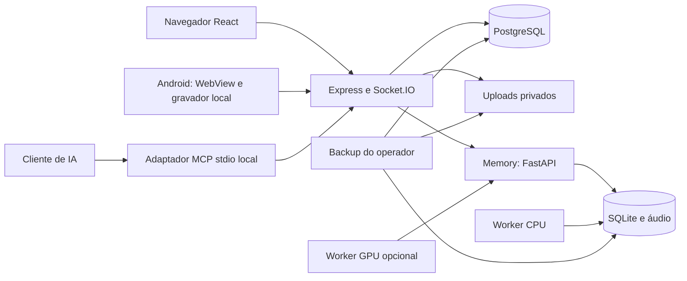

# Arquitetura

Brain Core é uma aplicação self-hosted com uma conta proprietária e contas de membros. O proprietário administra a instalação; cada conta tem seus dados, dispositivos, configurações de transcrição e credenciais MCP. Compartilhamento de páginas usa concessões explícitas de leitura ou edição, sem links públicos.

## Componentes e fronteiras

| Componente | Responsabilidade e acesso |
| --- | --- |
| Backend | Autenticação, propriedade, compartilhamento, revisões, uploads, dispositivos e integrações. HTTP e WebSocket precisam de sessão válida; revogação e expiração encerram sockets. |
| PostgreSQL | Contas, páginas/históricos, notas rápidas/históricos, anexos, contatos, concessões e credenciais/auditoria MCP. |
| Memory | Sessões, chunks, transcrições, jobs e referências de voz. Seu token de serviço tem autoridade global: o backend associa cada chamada à conta autenticada. |
| Workers CPU/GPU | Processam jobs admitidos pela política da conta. Pausa bloqueia novos jobs; um job já iniciado pode terminar. |
| Android | Captura local em armazenamento privado; credencial de dispositivo criptografada por Android Keystore; sincronização vinculada à conta. Notas locais Android ainda não sincronizam com notas web. |
| MCP | Processo stdio iniciado pelo cliente no computador. Chama `/api/agent` em HTTP loopback e usa token com conta, escopos e validade próprios. Não abre outra porta. |
| Terminal | Opcional e restrito ao proprietário. Executa com os privilégios do usuário do backend no sistema operacional; a pasta inicial permitida não é um sandbox. |

Na composição padrão, Nginx publica somente `127.0.0.1:8080`. Backend e PostgreSQL ficam na rede interna. Na instalação nativa, o backend usa loopback por padrão e pode servir o frontend compilado na mesma origem. Memory começa offline; CPU, GPU, OpenAI, Telegram e terminal são opcionais.

O primeiro acesso cria o proprietário apenas em banco vazio. Membros são criados pelo operador com `backend/scripts/create-member.cjs`. O bootstrap aplica DDL aditivo/idempotente. Dados legados sem proprietário só são atribuídos automaticamente quando há exatamente uma conta; ambiguidades interrompem a migração.

## Persistência e privacidade

O backend nativo usa `UPLOADS_DIR` ou `backend/uploads`; Docker usa `/app/uploads` no volume `brain-core-uploads`. Memory usa `CELTWO_MEMORY_DATA_DIR` e `CELTWO_MEMORY_DB_PATH`. O backup deve apontar para esses mesmos recursos, conforme [o guia](BACKUP_BRAIN_CORE.md).

Autenticação e isolamento entre contas protegem as rotas da aplicação. Arquivos, bancos, logs e backups no servidor dependem também das permissões e da proteção do disco do operador. Brain Core não fornece criptografia geral de conteúdo em repouso. Programas com acesso ao mesmo usuário do sistema operacional podem acessar seus arquivos privados.

OpenAI recebe texto quando a organização por IA é solicitada e configurada. Telegram recebe trechos de lembretes quando habilitado pela conta. O cliente MCP recebe as notas que consultar e pode processá-las no provedor escolhido. Imagens externas inseridas em documentos podem gerar requisições do navegador. A instalação local não elimina essas transferências opcionais.

Detalhes: [MCP](NOTES_MCP.md), [banco](BANCO_DE_DADOS.md), [Timeline](REMEMBER_TIMELINE.md), [Android](ANDROID.md), [Docker](DOCKER.md) e [acesso HTTPS](TAILSCALE.md).
